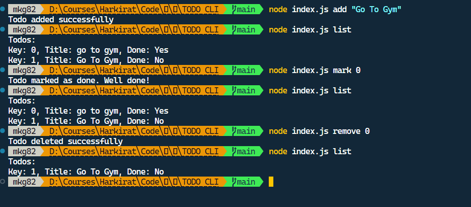

# ToDo CLI Tool

A command-line interface (CLI) tool for managing ToDo items using Node.js. This tool allows you to add, remove, mark tasks as done, and list all ToDos, all stored in a JSON file.

## Features

- **Add**: Add a new ToDo item.
- **Remove**: Remove a ToDo item by its key.
- **Mark**: Mark a ToDo item as done.
- **List**: List all ToDo items with their status.

## Screenshots




## Installation

1. Clone the repository:
   ```bash
   git clone https://github.com/yourusername/todo-cli.git
   cd todo-cli
2. Install the dependencies:
  ```bash
    npm install
```
## Usage
Add a ToDo
Add a new ToDo item with a title:

```bash
node yourScriptName.js add "Your ToDo Title"
```
### Remove a ToDo
Remove a ToDo item by its key:

```bash
node yourScriptName.js remove <Key>
```
### Mark a ToDo as Done
Mark a ToDo item as done by its key:
```bash
node yourScriptName.js mark <Key>
```
### List All ToDos
List all ToDo items with their status:
```bash
node yourScriptName.js list
```
## File Structure
todos.json: Stores all the ToDo items. Each item has a Key, Title, and Done status.
yourScriptName.js: The main script file for the CLI tool.
